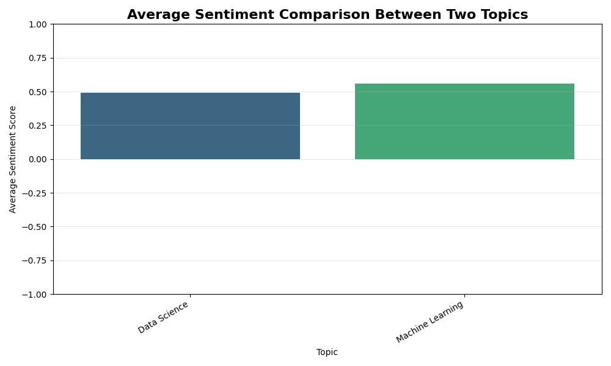
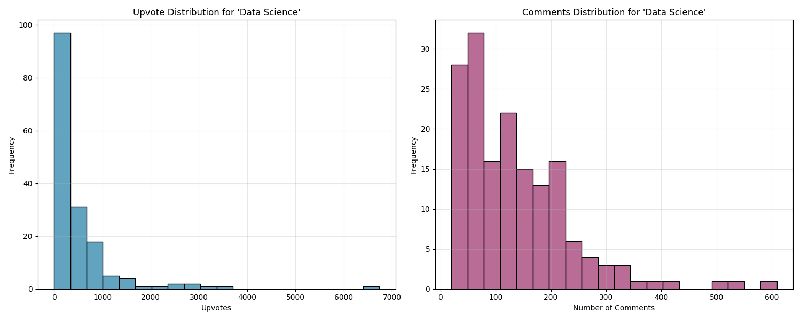
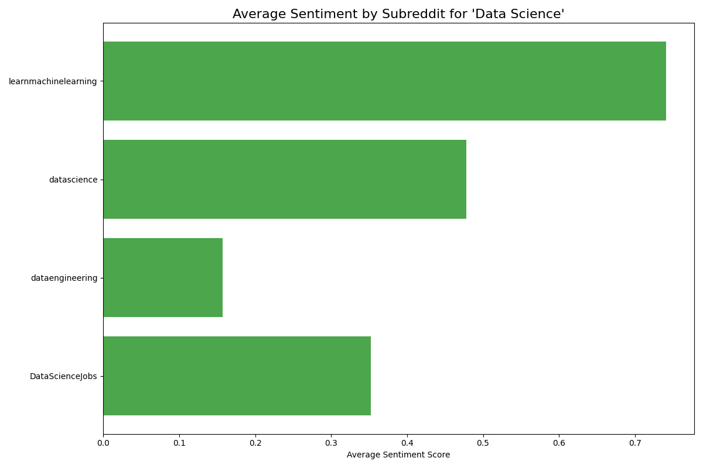
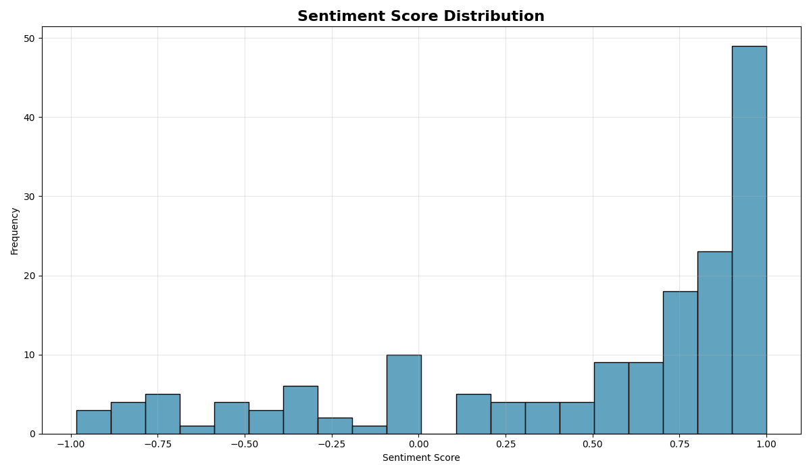
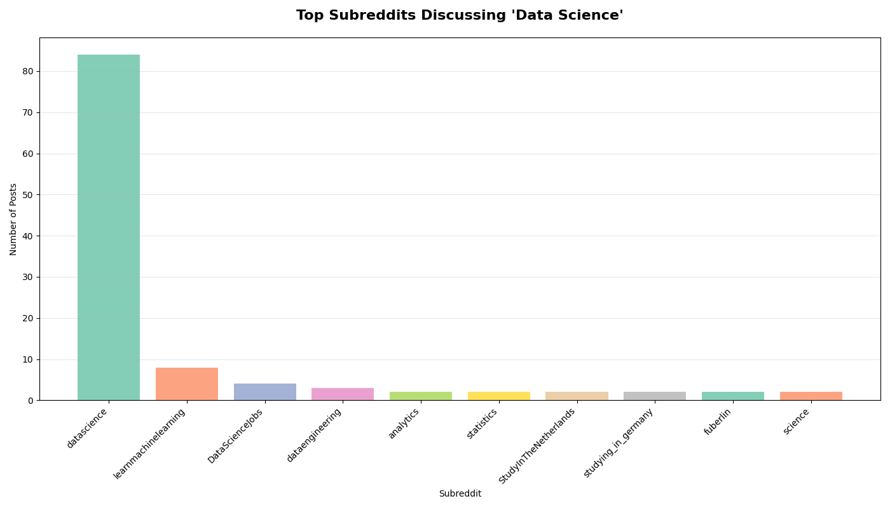

# 📊 Reddit Sentimental Analysis Project

**Reddit Sentimental Analysis** helps analyze thousands of Reddit posts and comments on any chosen topic, classifying them as positive, negative, or neutral using sentiment scores derived from NLTK’s VADER. The project extracts data directly from Reddit’s API, cleans and processes the text, and then generates insightful visualizations to highlight sentiment trends, engagement patterns, and subreddit-level discussions.

This repository contains a beginner-friendly implementation of:
   * 🔍 **Reddit Data Extraction** (using PRAW API)
   * 🧹 **Data Cleaning & Preprocessing**
   * 😀 **Sentiment Analysis** with NLTK’s VADER
   * 📊 **Visualizations** (Matplotlib + Seaborn)
   * 💾 **Data Storage** (CSV + MySQL database)
---

## 📁 Project Structure

```
reddit-sentiment-analysis/  
├── 📄 main.py                  # Main script to execute the project  
├── 📄 api_key.py               # Reddit API credentials (⚠️ add to .gitignore)  
├── 📄 database_credentials.py  # Database connection settings (⚠️ add to .gitignore)  
├── 📄 requirements.txt         # Python dependencies list  
├── 📂 pngs/                    # Folder containing generated visualizations  
├── 📂 data/                    # Folder for generated CSV files (optional)  
├── 📄 README.md                # Project documentation  
└── 📄 .gitignore               # Specifies files to ignore in version control  
```

---

## 🔧 Requirements

### 1. Install Python Libraries

```bash
pip install praw pandas matplotlib seaborn nltk sqlalchemy mysql-connector-python
```

### 2. Set Up Reddit API

Create a file called `api_key.py` with your Reddit credentials:

```python
import praw

reddit = praw.Reddit(
    client_id="YOUR_CLIENT_ID",
    client_secret="YOUR_CLIENT_SECRET",
    user_agent="YOUR_APP_NAME"
)
```

You can get these by creating an app at: [https://www.reddit.com/prefs/apps](https://www.reddit.com/prefs/apps)

---

### 3. Set Up MySQL Connection

Create a file called `database_credentials.py`:

```python
from sqlalchemy import create_engine

USER = "your_mysql_user"
PASSWORD = "your_mysql_password"
HOST = "localhost"
DB_NAME = "reddit_analysis"

engine = create_engine(f"mysql+mysqlconnector://{USER}:{PASSWORD}@{HOST}/{DB_NAME}")
```

Also, make sure you have created the database:

```sql
CREATE DATABASE reddit_analysis;
```

---

## ▶️ How to Run

```bash
python main.py
```

* Enter a topic when prompted (e.g., `Data Science`, `Machine Learning`).

---

## 📂 Outputs

### CSV Files

* `reddit_<topic>_data.csv` → Raw + Cleaned Data
* `sentimental_analysis_<topic>_data.csv` → Sentiment Results

### Database

* Table: `reddit_posts` (inside MySQL `reddit_analysis` database)

---

## 📊 Visualizations

### 🔹 Comparison Between Data Science and Machine Learning



### 🔹 Engagement Metrics (Data Science)



### 🔹 Sentiment by Subreddit (Data Science)



### 🔹 Sentiment vs Engagement (Data Science)


### 🔹 Sentiment Score Distribution



### 🔹 Subreddit Distribution (Data Science)



---
