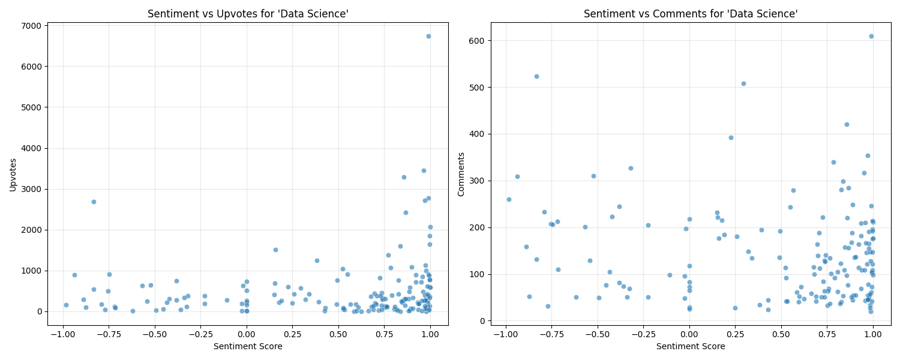

# 📊 Reddit Sentimental Analysis

This project extracts Reddit posts on any topic, performs **text cleaning**, runs **sentiment analysis** using **NLTK VADER**, and generates **visualizations**.
It also saves results to:

* **CSV files**
* **MySQL database**
* **Charts as PNG images**

---

## 🔧 Requirements

### 1. Install Python Libraries

```bash
pip install praw pandas matplotlib seaborn nltk sqlalchemy mysql-connector-python
```

### 2. Set Up Reddit API

Create a file called `api_key.py` with your Reddit credentials:

```python
import praw

reddit = praw.Reddit(
    client_id="YOUR_CLIENT_ID",
    client_secret="YOUR_CLIENT_SECRET",
    user_agent="YOUR_APP_NAME"
)
```

You can get these by creating an app at: [https://www.reddit.com/prefs/apps](https://www.reddit.com/prefs/apps)

---

### 3. Set Up MySQL Connection

Create a file called `database_credentials.py`:

```python
from sqlalchemy import create_engine

USER = "your_mysql_user"
PASSWORD = "your_mysql_password"
HOST = "localhost"
DB_NAME = "reddit_analysis"

engine = create_engine(f"mysql+mysqlconnector://{USER}:{PASSWORD}@{HOST}/{DB_NAME}")
```

Also, make sure you have created the database:

```sql
CREATE DATABASE reddit_analysis;
```

---

## ▶️ How to Run

```bash
python main.py
```

* Enter a topic when prompted (e.g., `Data Science`, `Machine Learning`).
* The program will:

  * Extract Reddit posts
  * Clean & preprocess data
  * Perform sentiment analysis
  * Save CSV outputs
  * Save results to MySQL
  * Generate charts

---

## 📂 Outputs

### CSV Files

* `reddit_<topic>_data.csv` → Raw + Cleaned Data
* `sentimental_analysis_<topic>_data.csv` → Sentiment Results

### Database

* Table: `reddit_posts` (inside MySQL `reddit_analysis` database)

---

## 📊 Visualizations

### 🔹 Comparison Between Data Science and Machine Learning


### 🔹 Engagement Metrics (Data Science)


### 🔹 Sentiment by Subreddit (Data Science)

[Sentiment by Subreddit](pngs/sentiment_by_subreddit_Data_Science.png)

### 🔹 Sentiment vs Engagement (Data Science)



### 🔹 Sentiment Score Distribution


### 🔹 Subreddit Distribution (Data Science)


---

## 📌 Features

* Histogram of sentiment scores
* Subreddit distribution of discussions
* Engagement metrics (Upvotes & Comments)
* Sentiment vs Engagement correlation
* Average sentiment per subreddit
* Compare two topics side by side

---

## 🚀 Next Steps

* Add more advanced sentiment models (Transformers, BERT).
* Deploy as a dashboard (Streamlit / Dash).
* Automate periodic runs (cron jobs).

---

